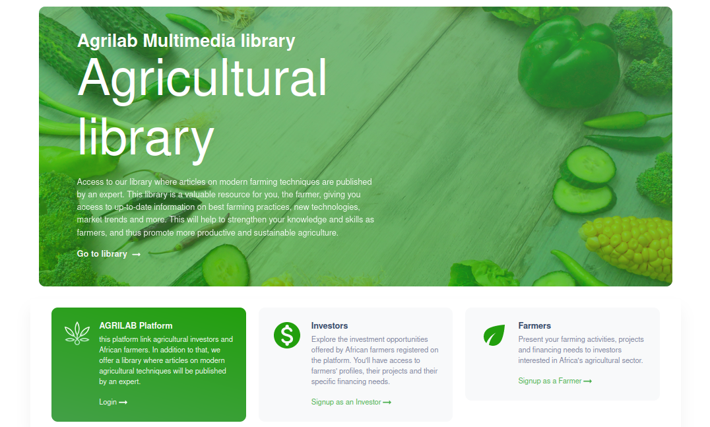

# AGRILAB Project

This project is a platform linking agricultural investors and African farmers. In addition to that, we offer a library where articles on modern agricultural techniques will be published by an expert.

  

 

<h3 align="center">
    🔹
    <a href="https://github.com/Tp-Td-TPE-M1-INFO/AGRI-LAB-Frontend/issues">Report Bug</a> &nbsp; &nbsp;
    🔹
    <a href="https://github.com/Tp-Td-TPE-M1-INFO/AGRI-LAB-Backend/issues">Request Feature</a>
</h3>

## Available Scripts

After you clone the repository, you need to install some dependancies first before running the program.
So, in each frontend or backend project directory, you must run:

### `npm install`

And in the each project directory, you can run:

### `npm start`

When the two installations done, runs the app in the development mode.\
Open [http://localhost:3000](http://localhost:3000) to view it in your browser.

The page will reload when you make changes.\

## Built With

This project was built using these technologies.

- React.js added with [Create React App](https://github.com/facebook/create-react-app)
- CSS3
- VsCode
- Render

## Features

**📖 Multi-Page Layout**

**🎨 Styled with Material Ui and Bootstrap with easy to customize colors**

**📱 Responsive**

### Show your support

Give a ⭐ if you like our platform!
